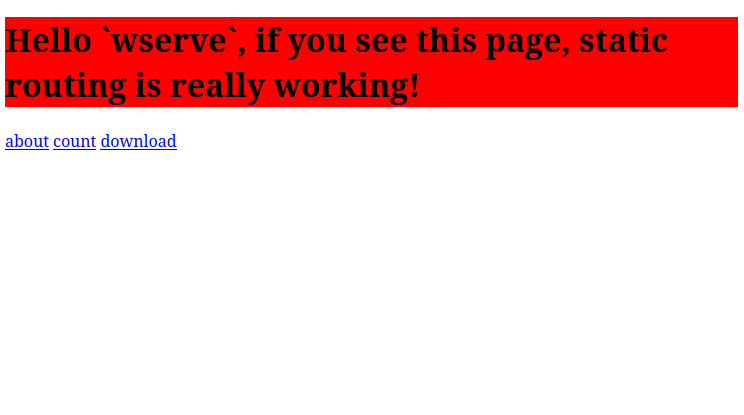

# WSERVE: Static Web Server in Pure C

This is a static IPv4 Linux web server written in pure C. No external libraries used. Even the parser is written in pure C. It supports a subset of HTTP/1.1. The target goal is to build a WSGI web application framework, like Flask, that will support GET, HEAD, POST methods. Future goals are HTTPS support through [bearSSL](https://www.bearssl.org/), `Transfer-Encoding` support, extensive E2E testing and a stable release.

## Features

- IPv4 supported.
- Pure C.
- HTTP/1.1 subset.
- GET and HEAD supported. POST is planned.
- Static serving.
- Extensive MIME types support.
- Automatic rejection of malformed requests.
- Prevention of static directory escape.
- Extensive error responses.

## Not supported

- Dynamic routes
- Functional `POST` handling
- Keep-alive connections
- HTTPS
- Chunked transfer encoding
- Production hardening or compatibility guarantees

## Roadmap

- [x] TCP Server
- [x] HTTP Parser
- [x] Static Routing
- [ ] Dynamic Routing

For detailed version roadmap, see [PLAN.md](PLAN.md).

## Disclaimer

This is a learning project by a single developer. Use it only as a reference. It is highly discouraged to use it in production, or even if personal, in open web. It has a relatively small test set with quick code inspection using some LLMs. There are much better HTTP server implementations available in C out there. If you really want to use it in production, or in open web, that is entirely on you.

## Requirements

- Linux kernel 5.6 or later (`openat2()` is required)
- GCC
- Make

## Installation

1. `git clone https://github.com/degD/wserve`
2. `cd wserve`
3. `make`
4. `./wserve`

To run unit tests:

1. `make test.parser && ./test.parser`
2. `make test.static && ./test.static`

## Configuration

By default, the web server runs on port `6543` ([http://localhost:6543](http://localhost:6543)) and uses `test/static` as the root of the static assets. `test/static` includes a demo site. After compiling and running, visit this site to see the server in action. Server defaults are set by using the function `init_server_settings`. Modify the call of `init_server_settings` in `main.c` to change the configuration and compile again.



```c
init_server_settings(
    "test/static", 
    "6543", 
    100, 
    1024, 
    1024*1024
);
```

- **root**: The directory of static assets.
- **port**: Port the server will listen.
- **backlog**: Max number of requests to be kept on the queue. 
- **max_recv_size**: Max number of bytes to receive in a single step.
- **total_req_size**: Max size of a request.

## Source

The source code consists of a single file: `wserve.c`. Inside, the code is divided roughly into 5 sections. As the time of writing, `DYNAMIC ROUTING` section is in progress:

- `SERVER TCP FUNCTIONS`
- `HTTP HEADERS PARSER`
- `HTTP SERVER`
- `STATIC ROUTING`
- `DYNAMIC ROUTING`

## Credits

- [https://beej.us/guide/bgnet/html/split/](https://beej.us/guide/bgnet/html/split/)
- [https://www.rfc-editor.org/info/rfc7230](https://www.rfc-editor.org/info/rfc7230)

For detailed credits for of each development version, see [PLAN.md](PLAN.md).

## License

MIT
